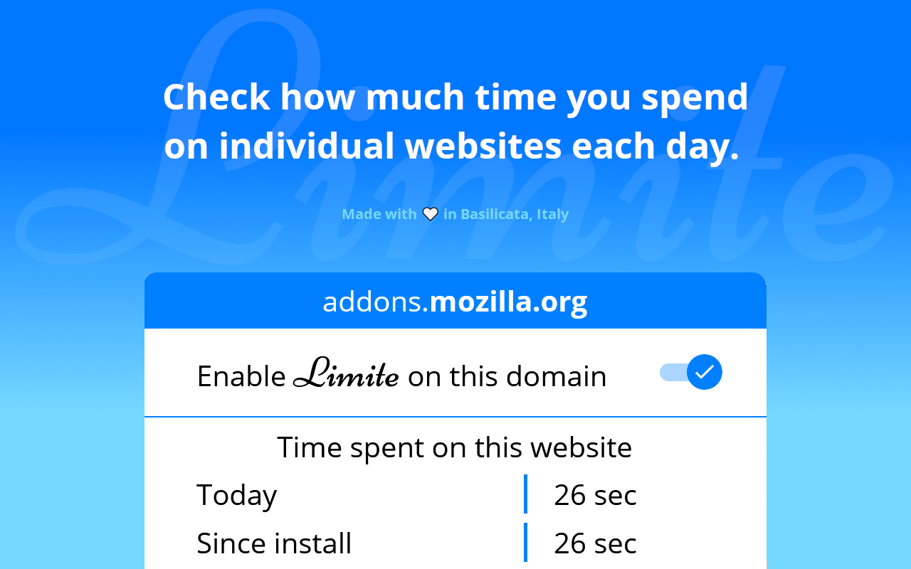

<h1 align="center">
     
    
     
</h1>
Official repo of https://addons.mozilla.org/it/firefox/addon/limite/.

  

 

To support me, you can do a donation :smile: with **PayPal**, **LiberaPay** or **Ko-Fi**:

 [</img>](https://paypal.me/pools/c/8yl6auiU6e) [</img>](https://ko-fi.com/R5R31UQ8G)

## Description

Check how much time you spend on each website every day.
Optimise your productivity, your time and your life as well.
Don't lose precious time!

This app permits you to check how much time you spend on each website every day.
You can also see how much time you spent on a specific website since you installed the addon.

You can disable/enable the addon on your favourite websites and how you prefer.

## Features

- See *Today* time
- See *Since install* time
- Enable/Disable the add-on, based on your preferences and with a single click

## How to contribute

You can open an issue and there you must describe the feedback, the bug or the new feature you want.

## Screenshots

See folder <code>screenshots</code> to see screenshots also of the older versions.

</img>